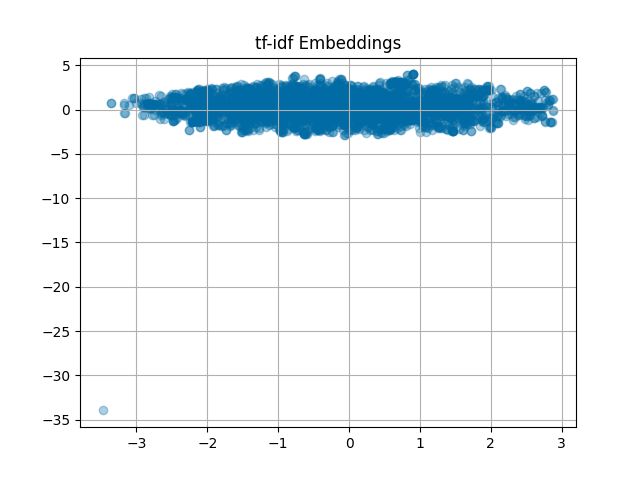
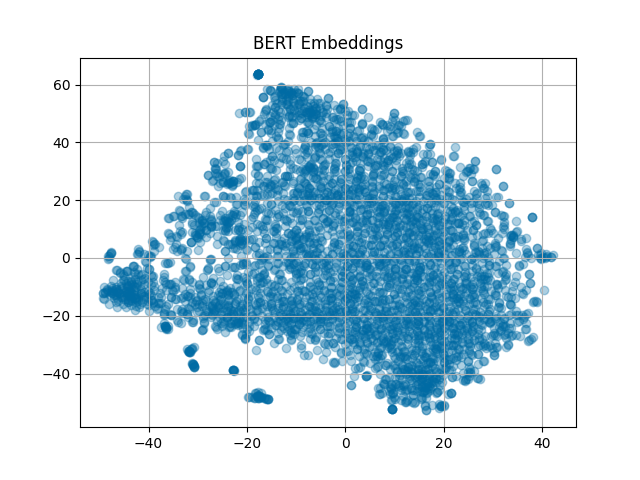
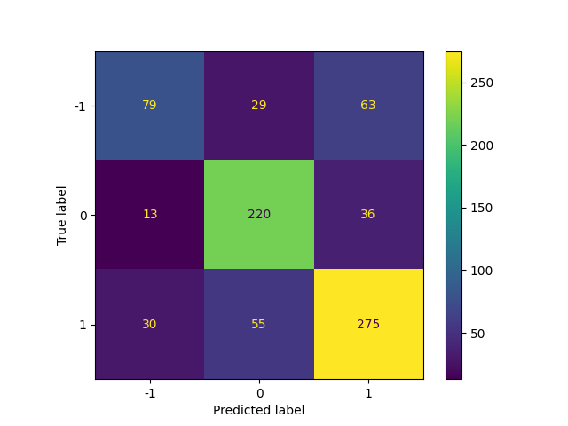

# tfidf-bert-sentiment

Comparing BERT and tf-idf Embeddings for Sentiment Analysis

## Embeddings

### tf-idf



### BERT



## Results

The best model was Multilayer Perceptron (MLP).

```
              precision    recall  f1-score   support

          -1       0.65      0.46      0.54       171
           0       0.72      0.82      0.77       269
           1       0.74      0.76      0.75       360

    accuracy                           0.72       800
   macro avg       0.70      0.68      0.69       800
weighted avg       0.71      0.72      0.71       800
```

### Confusion Matrix

The confusion matrix for the MLP results with tf-idf embeddings:



## License

[MIT License](LICENSE)
